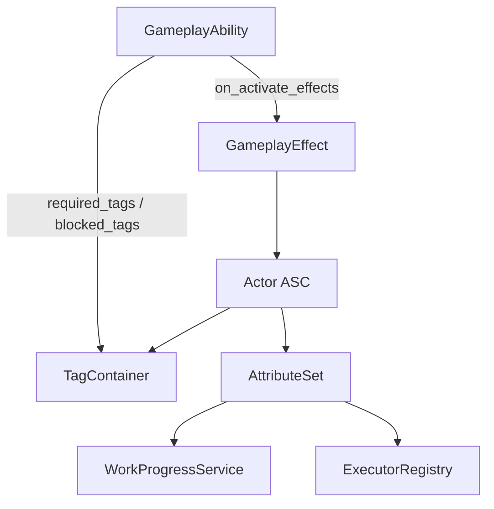

> 状态：草稿
> 校验状态：待校验
> 对应规范：[SO配置与能力通道规范](../../00-规范/SO配置与能力通道规范.md)

← [运行时逻辑](./README.md)

# Effect 与能力解析

## 目标

城区能力、队伍能力、设施效果、领袖特质、环境减值统一采用 **GAS-lite** 管线：

- `GameplayEffect`：效果 / Buff / Debuff / 瞬时修正 / 周期效果。
- `GameplayTag`：能力开关、状态与互斥条件。
- `GameplayAbility`：可执行技能薄壳，负责消耗、目标过滤、激活条件与 `executor_key`。
- `AttributeSet`：统一数值命名空间。
- `AbilitySystemComponent`：挂在队伍、城区、格子或势力上的运行时效果容器。

指令表、行动表、响应检测器与 `on_resolve` 作用不并入本管线。

## 程序入口

| 对象 | 程序类型 | 路径 |
|------|----------|------|
| 效果容器 | `AbilitySystemComponent` | `Assets/Scripts/Yanxu.Core/Effects/AbilitySystemComponent.cs` |
| GE 配置 | `GameplayEffectConfigSO` | `Assets/Scripts/Yanxu.Core/Effects/Config/GameplayEffectConfigSO.cs` |
| GA 配置 | `GameplayAbilityConfigSO` | `Assets/Scripts/Yanxu.Core/Effects/Config/GameplayAbilityConfigSO.cs` |
| Tag 注册 | `GameplayTagId` | `Assets/Scripts/Yanxu.Core/Effects/GameplayTagId.cs` |
| Attribute 注册 | `GameplayAttributeId` | `Assets/Scripts/Yanxu.Core/Effects/GameplayAttributeId.cs` |
| 贡献快照 | `EffectContributionSnapshot` | `Assets/Scripts/Yanxu.Core/Effects/EffectContributionSnapshot.cs` |

## Tag 注册表（首版）

| Tag | 说明 |
|-----|------|
| `Capability.Move` | 可执行移动 |
| `Capability.DockToSail` | 可执行离港 |
| `Capability.SailToDock` | 可执行入港 |
| `Capability.ScoutScan` | 可执行侦察扫描 |
| `Capability.ProspectScan` | 可执行勘探扫描 |
| `Capability.Build` | 可执行建造 |
| `Capability.TransportCargo` | 可执行搬运 |
| `Capability.District.Academy` | 可激活学院城区能力 |
| `Capability.District.Cannon` | 可激活巨炮城区能力 |
| `District.Academy.Active` | 学院切换式能力已开启 |
| `State.InDarkZone` | 位于暗渊带 |
| `Buff.Wall` | 城墙 Buff 生效 |

## Attribute 注册表（首版）

| Attribute | 说明 |
|-----------|------|
| `work_efficiency` | 工作效率，工作开始时快照锁定 |
| `move_speed` | 移动速度倍率 |
| `vision_range` | 视野范围 |
| `defender_loss_reduction` | 防守方人口损失倍率 |
| `headcount_ratio` | 当前人数比 |

## 运行流程

1. 模板或城区初始化时，向 ASC 注册 GA，并 Apply 初始 GE。
2. 指令执行前，按指令类型映射到 `ga_id`，调用 `ASC.TryActivateAbility`。
3. GA 检查 `required_tags` / `blocked_tags`；失败则写 `fail_reason`。
4. GA 激活后可 Apply GE；具体局面变更仍由 executor、工作或交战管线处理。
5. 工作开始时调用 `ASC.GetComputedAttribute("work_efficiency")`，生成 `EffectContributionSnapshot` 并锁定 `work_duration_turn`。

## 废止映射

| 旧对象 | 新对象 |
|--------|--------|
| `ability_set_config` | 模板初始 GE + GA 列表 |
| `ability_channel_config` | `GameplayAbilityConfigSO` |
| `AbilityExecutionGate` | `AbilitySystemComponent.TryActivateAbility` |
| `TeamAbilityCatalogService` | ASC `TagContainer` |
| `IStatModifierProvider` | `GameplayEffectConfigSO.modifiers` |
| `stat_value_channel_entry` | `EffectContributionSnapshot.Entries` |

## 工作时长规则

- `work_efficiency` 的贡献来源只来自 ASC 上的 GE。
- 指挥预览与行动执行必须读取同一 Attribute 合成逻辑。
- 工作开始后锁定 `work_duration_turn`；进行中不因 GE 变化重算。

## 与响应检测器的关系

响应检测器仍是条件检测层：检测通过后触发行为。若行为结果需要施加持续影响（如陷阱造成 debuff），由该行为 Apply GE；检测器本身不注册 GE。

## 修订记录

| 日期 | 版本 | 说明 |
|------|------|------|
| 2026-06-29 | 0.0.1 | GAS-lite 定案：GE + Tag + GA + AttributeSet 统一管线 |
