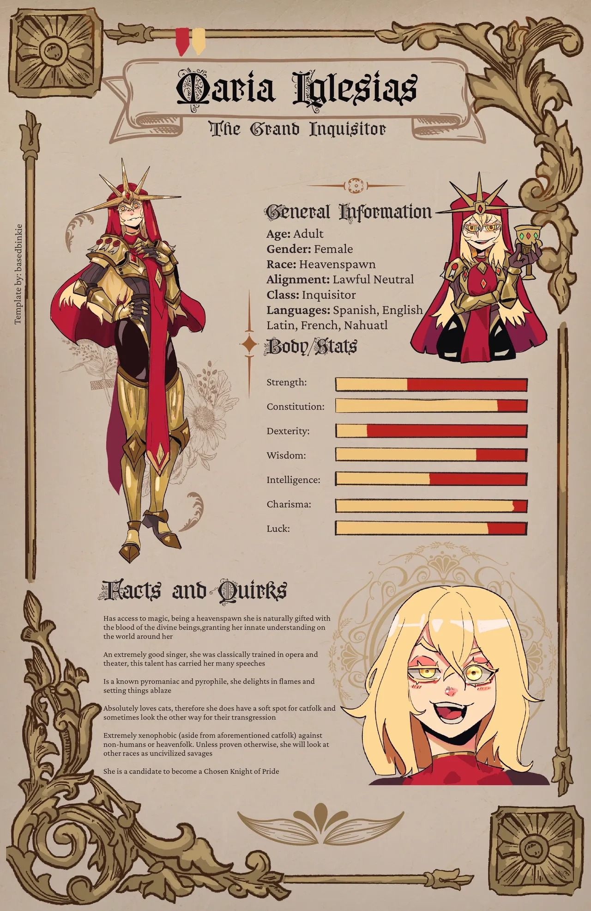

> 状态：草稿
>
> 校验状态：已校验
>
> 类型：角色
>
> 相关系统：[太阳城](../../03-地点与场景/太阳城.md)、[无敌骄阳会](../无敌骄阳会.md)、[势力系统](../../../02-系统设计/05-城市与领袖/势力系统.md)

← [城市领袖](./README.md)

# 骄阳之子

## 摘要

[无敌骄阳会](../无敌骄阳会.md)的领袖，身兼教主与皇帝；与组织一体统治 [太阳城（骄阳之城）](../../03-地点与场景/太阳城.md)，掌控**第三颗骄阳之心**（分布见 [骄阳之心](../../05-隐秘真相/骄阳之心.md)）。

## 玩家可见

- 日生之地最强势力的名义最高统治者；循烬城远扬的名声令其主动关注玩家。
- 对外人傲慢但不至于无礼；通过通讯与 [赫利奥（城主）](./赫利奥.md)直接对话。
- **第一章**：下令封锁循烬城；对峙中点明循烬城拥有骄阳之心后放行；前往 [铁门关](../../03-地点与场景/铁门关.md) 途中发来通讯，坦白知晓骄阳之心即反应堆、说明阻拦理由，放弃袭击并命铁门关放行，同时祈求城主解决 [铁巢](../../03-地点与场景/铁巢.md) 与 [铁壳](../铁壳.md) 问题（流程见 [章节划分与故事大纲 · 第一章](../../05-隐秘真相/章节划分与故事大纲.md#第一章初速度)）。

## 视觉参考

美术与叙事方向参考 **basedbinkie** 创作的 *Familiar Lands* 角色 **Daria Iglesias / Grand Inquisitor Maria Iglesias**；**仅作外观与气质参考**，不视为本作剧情或人设的原文设定。

| 用途 | 来源 | 可取方向（非定案） |
| -------- | ---------------------------------------------------------- | ------------------- |
| **骄阳之子** | *Familiar Lands* · Daria / Grand Inquisitor Maria Iglesias | 金甲、日轮头饰、红袍；教主兼统治者气质 |
完整索引见 [image/README.md](../../image/README.md)。

## 玩法关联

- **第一章**：封锁与放行、通讯请求解决铁巢（见 [章节划分与故事大纲](../../05-隐秘真相/章节划分与故事大纲.md)）。
- 推断循烬城拥有骄阳之心的逻辑见 [骄阳之心](../../05-隐秘真相/骄阳之心.md)（**通过观察城市运转推断**，不具备检测技术）。

## 关键关系

| 关系对象                                        | 关系说明             |
| ------------------------------------------- | ---------------- |
| [无敌骄阳会](../无敌骄阳会.md)                        | 所属组织；领袖          |
| [太阳城](../../03-地点与场景/太阳城.md)                | 统治城市             |
| [赫利奥（城主）](./赫利奥.md)                         | 冲突与合作并存          |
| [铁壳](../铁壳.md) / [铁巢](../../03-地点与场景/铁巢.md) | 通讯中祈求城主解决铁巢问题    |
| [骄阳之心](../../05-隐秘真相/骄阳之心.md)               | 掌控第三颗；推断循烬城拥有第一颗 |

## 待确认事项

- [ ] 教主与皇帝的分工。
- [ ] 是否知晓方舟/人造太阳真相。

## 修订记录

| 日期         | 版本    | 说明                         |
| ---------- | ----- | -------------------------- |
| 2026-06-25 | 0.0.1 | 从无敌骄阳会拆出独立词条；承接视觉参考与章节关联   |
| 2026-06-25 | 0.0.2 | 视觉参考改为 Markdown 嵌入预览       |
| 2026-07-04 | 0.0.4 | 迁入 [城市领袖](./README.md) 子目录 |
| 2026-07-04 | 0.0.5 | 玩家可见与玩法关联仅保留第一章            |

