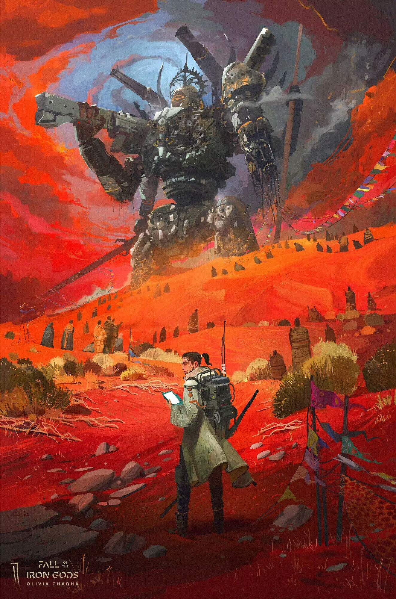
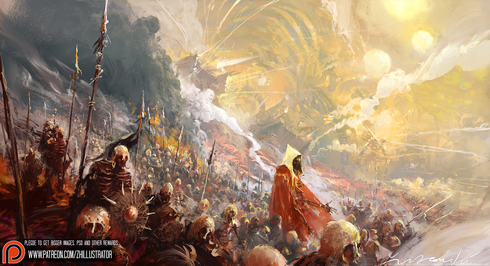

> 状态：草稿
> 
> 校验状态：已校验
> 
> 类型：势力
> 
> 相关系统：[铁巢](../03-地点与场景/铁巢.md)、[铁巢废墟](../03-地点与场景/铁巢废墟.md)、[势力系统](../../02-系统设计/05-城市与领袖/势力系统.md)

← [角色与势力](./README.md)

# 铁壳（Qiào）

## 摘要

游荡于 [铁门关](../03-地点与场景/铁门关.md) 之外的**机械体势力**，由远古智能体 **巢主** 统领，据点在 [铁巢](../03-地点与场景/铁巢.md)。与 [无敌骄阳会](./无敌骄阳会.md) 永久敌对。

## 设定母本（秘密，L1、L2）

### 起源（L1）

铁壳是**方舟内部的修复机器**，负责方舟的维护与修复工作。太阳停转后，与太阳共同运转的能量传递系统无法给整个方舟供能。铁壳可借用反应堆（骄阳之心）维持自身运作。

### 铁巢坠落（L2）

太阳本应向铁巢方向前进，但因轨道故障，在日生之地停了下来。铁巢与随行铁壳因事故坠落到日生之地，从太阳城夺走一颗骄阳之心，最终坠毁成为[铁巢废墟](../03-地点与场景/铁巢废墟.md)。因距离太阳太远（太阳被调成超低功率），它们没有足够能量返回，遂以夺得的骄阳之心维持运作，苟活至今。

### 与骄阳会敌对

铁巢坠落时从太阳城夺走过一颗骄阳之心——这导致了无敌骄阳会与铁壳**无法改善的敌对关系**。

## 玩家可见

- 单位在 [铁巢废墟](../03-地点与场景/铁巢废墟.md) 内外巡逻；关外到处可见。
- **与玩家交好**时，可分享金属、能源（单次量少）；**对玩家敌对**时，以同等态度回应——你如何对待它们，它们便如何对待你。
- 被太阳照射后会恢复活力，敌对时更危险。

## 视觉参考

**仅作外观与气质参考**，不视为本作剧情或人设的原文设定。与 [荒地](../03-地点与场景/荒地.md)、[猎壳人](./猎壳人.md#视觉参考) 共用场景参考 *Fall of the Iron Gods*（`铁壳与日生之地参考.jpg`，图中巨型机械体侧重铁壳气质）；另见专题参考 `铁壳与猎壳人参考.jpg`。

| 用途 | 来源 | 可取方向（非定案） |
|------|------|-------------------|
| **铁壳**（单位/巨型个体） | *Fall of the Iron Gods* | 巨型残破机械体、工业感、前文明遗留的压迫尺度 |

| 用途 | 来源 | 可取方向（非定案） |
|------|------|-------------------|
| **铁壳** / **猎壳人**（关外冲突） | 项目参考图 `铁壳与猎壳人参考.jpg` | 关外铁壳集群与猎壳人部队对峙、征战场面的戏剧张力 |

完整索引见 [image/README.md](../image/README.md)。

## 玩法关联

- **第二章**：
  - 穿越 荒地 → 遭遇巡逻 → 建立关系 → 进入 [铁巢废墟](../03-地点与场景/铁巢废墟.md) → 抵达 [铁巢](../03-地点与场景/铁巢.md) 与巢主接触。
  - **站队**：与 [猎壳人](./猎壳人.md)对立（协助猎杀铁壳）或交好（接受铁壳分享），影响物资来源与 [铁巢](../03-地点与场景/铁巢.md) 和猎壳人的终局关系；规则见 [章节划分与故事大纲 · 猎壳人与铁壳](../05-隐秘真相/章节划分与故事大纲.md#猎壳人与铁壳站队分支)。
- **第二颗骄阳之心**：见 [铁巢](../03-地点与场景/铁巢.md)。
- 关系与组织规则见 [势力系统](../../02-系统设计/05-城市与领袖/势力系统.md)。

## 关键关系

| 关系对象                                 | 关系说明           |
| ------------------------------------ | -------------- |
| [铁巢](../03-地点与场景/铁巢.md)              | 据点             |
| [铁巢废墟](../03-地点与场景/铁巢废墟.md)          | 主要活动地区         |
| [无敌骄阳会](./无敌骄阳会.md)                  | 永久敌对           |
| [猎壳人](./猎壳人.md)                      | 关外狩猎部队；第二章站队对立面 |
| [铁门关](../03-地点与场景/铁门关.md)            | 不主动靠近的边界       |
| [荒地](../03-地点与场景/荒地.md)              | 巡逻与遭遇范围        |
| [循烬城](../03-地点与场景/循烬城.md) | 第二章站队影响关系与铁巢终局 |

## 待确认事项

- [ ] 单位种类与铁巢防御/攻城玩法细节。
- [ ] 与骄阳会敌对的根本原因。
- [ ] 巢主形态与失去骄阳之心后的状态。

## 修订记录

| 日期         | 版本    | 说明                     |
| ---------- | ----- | ---------------------- |
| 2026-06-22 | 0.0.1 | 初稿                     |
| 2026-06-23 | 0.0.2 | 大幅精简                   |
| 2026-06-23 | 0.0.3 | 删除 AI 城市相关表述           |
| 2026-06-23 | 0.0.4 | 删除它处词条已写明的构造体/骄阳之心重复句  |
| 2026-06-23 | 0.0.5 | 补第二章站队：交好分享物资、对等回应玩家态度 |
| 2026-06-25 | 0.0.6 | 补视觉参考：铁壳巨型机械外观 |
| 2026-06-25 | 0.0.7 | 猎壳人链至独立词条 |
| 2026-06-25 | 0.0.8 | 视觉参考改为 Markdown 嵌入预览 |
| 2026-07-04 | 0.0.9 | 补视觉参考：铁壳与猎壳人参考.jpg |

