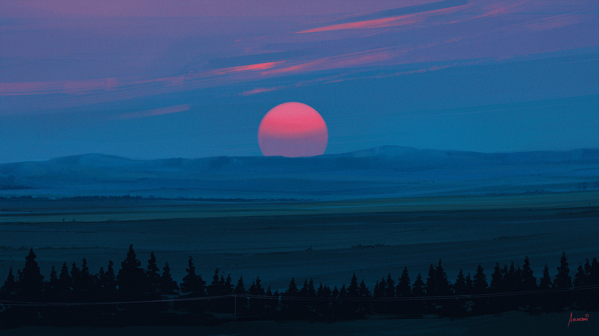
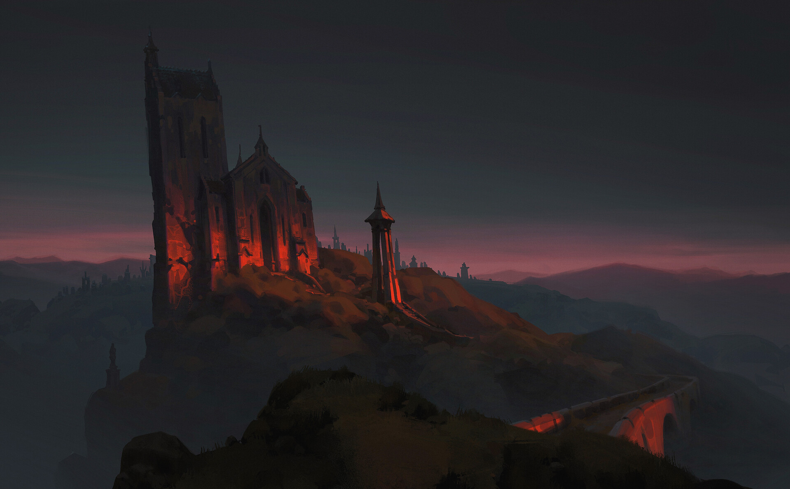
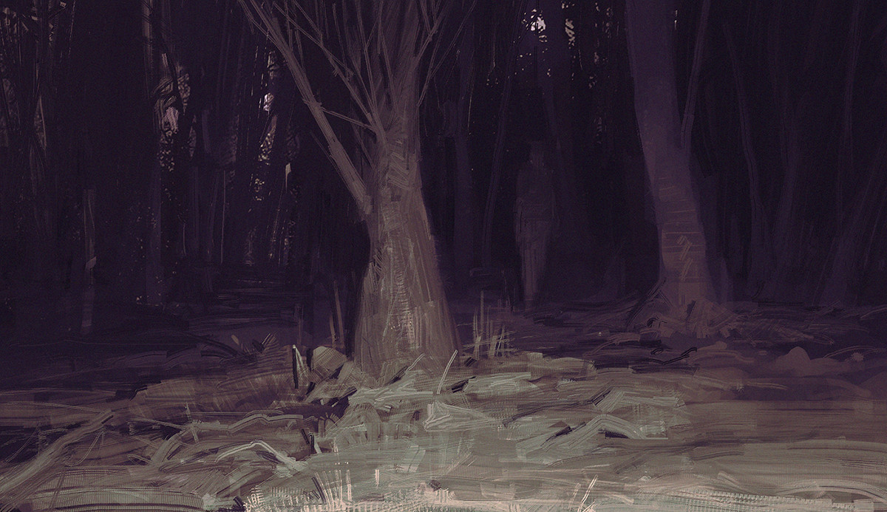

> 状态：草稿
> 校验状态：未校验
> 类型：地点-危险区域
> 相关系统：[太阳的真相](../05-隐秘真相/太阳的真相.md)

← [地点与场景](./README.md)

# 暗渊

## 摘要

太阳照射不到的区域——**凡不被太阳照射之处，民众统称暗渊**。地图上有**两处分区**（**渊光方向**、**荒地方向**），但设定上不作区分。

**太阳曾长期停在固定位置**（见 [世界的真相](../05-隐秘真相/世界的真相.md)）；**直到主线时期**太阳才开始移动。

## 玩家可见

- 常识：暗渊被彻骨冰寒所覆盖，除了探寻遗迹的冒险者之外，无人愿意前往；**世人**传说深处有旧神或先祖遗迹。
- **用语**：照不到太阳之处统称**暗渊**；太阳暗淡之时称**黄昏**。民众无「黑夜」这一说法。
- 环境寒冷、资源匮乏、寸草不生，民众将其恐怖化（见 [太阳的真相](../05-隐秘真相/太阳的真相.md)）。
- **渊光方向**（文档分区名，[渊光城](./渊光城.md) 与 [玩家起点](./玩家起点.md) 之间）：终局向下抵达渊光、渊光城所经的无日照区段。
- **荒地方向**（文档分区名，[荒地](./荒地.md) 与 [铁巢废墟](./铁巢废墟.md) 之间）：太阳**固定时**此处终年无光，与关外一样属暗渊。**太阳开始移动、向关外（向上）离去时**，光随太阳移入此方向，本地区才被照亮——**仅因太阳往此方向移动**，不是「太阳在头顶却照不到地面」。第一、二章追日即紧跟这道离去的光；第三起太阳再次远离，此处重归暗渊。

## 视觉参考

**仅作氛围与气质参考**，不视为地理或机制定案。

| 用途 | 来源 | 可取方向（非定案） |
|------|------|-------------------|
| **黄昏**（太阳暗淡） | Aenami | 低垂天体、冷色天幕与地平雾气；太阳移离、光线衰减时的压抑宁静感 |

| 用途 | 来源 | 可取方向（非定案） |
|------|------|-------------------|
| **暗渊**（吞没过程） | 项目参考图 `世界陷入暗渊.jpg` | 没有日照的区域在扩大，建筑与地貌沉入深紫阴影；强调暗渊在蔓延的压迫感 |

| 用途 | 来源 | 可取方向（非定案） |
|------|------|-------------------|
| **暗渊**（吞没之后） | 项目参考图 `完全被暗渊吞噬的世界.jpg` | 无日照的幽暗林地、冷色微光；暗渊覆盖后的死寂与未知 |

完整索引见 [image/README.md](../image/README.md)。

## 玩法关联

- **第三至五章**：太阳已离开循烬城路线，**全程无日照**；向下，地理上可途经铁门关、日生之地等，**环境上均属暗渊**。
- **第五章**：抵达 [暗渊](./暗渊.md) **渊光方向**的 [渊光](./渊光.md) / [渊光城](./渊光城.md)——非首次进入暗渊。
- 地图地理与章节见 [地点与场景 · 地图地理关系](./README.md#地图地理关系)、[章节划分与故事大纲](../05-隐秘真相/章节划分与故事大纲.md)。

## 关键关系

| 关系对象                         | 关系说明             |
| ---------------------------- | ---------------- |
| [渊光](./渊光.md)                | 位于暗渊渊光方向最深处      |
| [太阳的真相](../05-隐秘真相/太阳的真相.md) | 母本：暗渊即无光照区域，非超自然 |

## 待确认事项

- [ ] 暗渊环境特征（温度、能见度、地形）。
- [ ] 渊光方向与荒地方向的地形差异。
- [ ] 是否有特殊生物或现象（是否超自然）。

## 修订记录

| 日期         | 版本    | 说明                            |
| ---------- | ----- | ----------------------------- |
| 2026-06-22 | 0.0.1 | 初稿                            |
| 2026-06-23 | 0.0.2 | 精简：删除重复揭示层级与章节表               |
| 2026-06-23 | 0.0.3 | 关键关系只链铁巢废墟，不重复构造体定义           |
| 2026-06-23 | 0.0.4 | 补充卷轴地图邻接                      |
| 2026-06-23 | 0.0.5 | 明确卷轴两处格带：渊光方向、荒地方向            |
| 2026-06-23 | 0.0.6 | 定义收束：暗渊=一切不被太阳照射的区域           |
| 2026-06-23 | 0.0.7 | 修正荒地方向：固定时无照；移动时因太阳向关外离去而暂被照亮 |
| 2026-07-04 | 0.0.8 | 用语：暗渊=无日照之处，黄昏=太阳暗淡；删长暗季      |
| 2026-07-04 | 0.0.9 | 两处分区改称渊光方向、荒地方向               |
| 2026-07-04 | 0.0.10 | 补视觉参考：黄昏、世界陷入暗渊、完全被暗渊吞噬的世界 |

