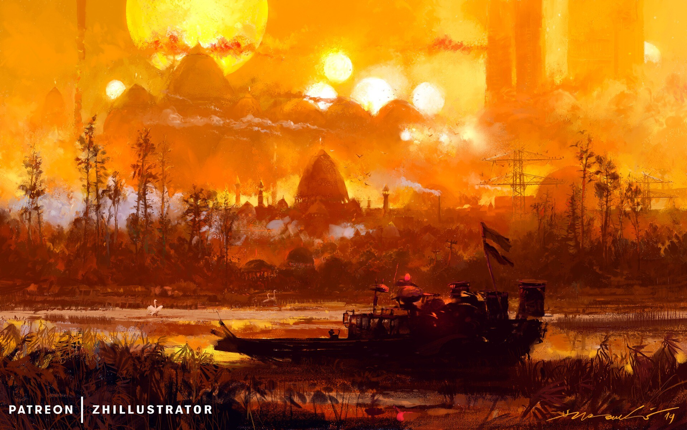
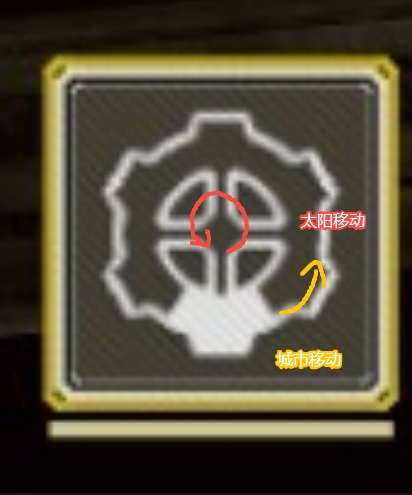

← [设定目录](../README.md)

# 设定参考图

本目录存放美术与叙事方向的**参考图**，不单独构成设定母本；具体设定仍以对应词条正文为准。各词条 **视觉参考** 节须用 Markdown 嵌入同路径图片，文档内可直接预览。

## 骄阳之子？

词条：[骄阳之子](../02-角色与势力/城市领袖/骄阳之子.md#视觉参考) · *Familiar Lands* / basedbinkie

---

## 无敌骄阳会

词条：[无敌骄阳会](../02-角色与势力/无敌骄阳会.md#视觉参考) · *Familiar Lands* / basedbinkie

---

## 太阳城

词条：[太阳城](../03-地点与场景/太阳城.md#视觉参考)

---

## 循烬城（方舟结构）

词条：[循烬城](../03-地点与场景/循烬城.md#视觉参考)

---

## 铁壳与日生之地参考

词条：[荒地](../03-地点与场景/荒地.md#视觉参考)、[铁壳](../02-角色与势力/铁壳.md#视觉参考)、[猎壳人](../02-角色与势力/猎壳人.md#视觉参考) · *Fall of the Iron Gods*

---

## 铁壳与猎壳人参考

词条：[铁壳](../02-角色与势力/铁壳.md#视觉参考)、[猎壳人](../02-角色与势力/猎壳人.md#视觉参考)

---

## 诸王国土

词条：[诸王国土](../02-角色与势力/诸王国土.md#视觉参考)

---

## 渊光教团

词条：[渊光教团](../02-角色与势力/渊光教团.md#视觉参考) · Anato Finnstark

---

## 暗渊 · 黄昏

词条：[暗渊](../03-地点与场景/暗渊.md#视觉参考)（民众用语「黄昏」= 太阳暗淡） · Aenami

---

## 暗渊 · 世界陷入暗渊

词条：[暗渊](../03-地点与场景/暗渊.md#视觉参考)

---

## 暗渊 · 完全被暗渊吞噬的世界

词条：[暗渊](../03-地点与场景/暗渊.md#视觉参考)

## 修订记录

| 日期 | 版本 | 说明 |
|------|------|------|
| 2026-06-25 | 0.0.1 | 初稿：索引骄阳之子、无敌骄阳会参考图 |
| 2026-06-25 | 0.0.2 | 补链荒地、铁壳、猎壳人参考图 |
| 2026-06-25 | 0.0.3 | 骄阳之子、猎壳人链至独立词条 |
| 2026-06-25 | 0.0.4 | 各图 Markdown 嵌入，文档内可预览 |
| 2026-07-04 | 0.0.5 | 新增太阳城、方舟结构、铁壳与猎壳人参考图索引 |
| 2026-07-04 | 0.0.6 | 新增诸王国土、渊光教团、暗渊（黄昏/吞没）参考图索引 |
