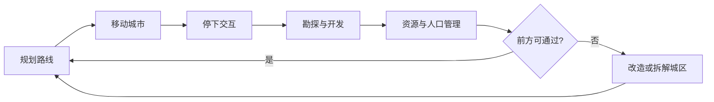

> 状态：草稿
> 类型：对外展示
> 受众：新成员、合作方、宣传素材底稿

# 《循光之城》游戏介绍

> 命名说明：游戏名为《循光之城》，项目代码仓库与本地目录名为 **延续**。本文档是对外展示入口；机制与设定的完整细节见各专题文档。

## 这是什么游戏

《循光之城》是一款侧重**资源管理与策略规划**的模拟经营游戏。你扮演一座[模块化移动城市](02-系统设计/03-模块与城市/城市模块化.md)的领袖，在文明覆灭又重生的后启示录废土上，驾驶整座城市追逐天空中开始移动的[太阳](04-设定/01-世界观/世界概述.md)，在资源、速度与牺牲之间做出艰难抉择，以求文明延续。

**一句话**：驾驶可拆解重组的移动城市，追逐太阳，在前进中延续文明。

**类型与基调**：后启示录 × 太阳朋克；绝望与希望并存，战略取舍带来明显的情感代价。详见 [核心幻想](02-系统设计/01-核心体验/核心幻想.md)、[核心体验与胜利条件](02-系统设计/01-核心系统/核心体验与胜利条件.md)。

## 世界观

文明覆灭又重生。太阳开始移动；离太阳越远，环境越严酷。幸存者以[移动城市](02-系统设计/03-模块与城市/城市模块化.md)为载具，在正六边形网格构成的[荒野](02-系统设计/02-资源循环/荒野地点.md)上前进——停滞意味着被黑暗与严寒吞没，前进本身即是意义。

| 主题 | 说明 | 详细文档 |
|------|------|----------|
| 世界法则 | 太阳、移动城市、荒野与前进的意义 | [世界概述](04-设定/01-世界观/世界概述.md) |
| 叙事与悬念 | 领袖抉择、牺牲记忆、后期隐藏设定 | [核心世界观](04-设定/01-世界观/核心世界观.md) |

## 你在做什么

### 玩家目标

| 阶段 | 目标 | 详细文档 |
|------|------|----------|
| 短期 | 维持[四种核心资源](02-系统设计/02-资源循环/四种核心资源.md)平衡，让城市在当前区域生存并补给 | [四种核心资源](02-系统设计/02-资源循环/四种核心资源.md) |
| 中期 | 通过[探索与扩张](02-系统设计/01-核心系统/探索与扩张.md)点亮荒野、建立采集站与驿站，扩张或重组城区以应对前方地形 | [探索与扩张](02-系统设计/01-核心系统/探索与扩张.md)、[城市模块化](02-系统设计/03-模块与城市/城市模块化.md) |
| 长期 | 驾驶城市抵达太阳所在地，延续文明；揭示世界隐藏设定 | [核心体验与胜利条件](02-系统设计/01-核心系统/核心体验与胜利条件.md) |

### 胜利条件

最终目标是驾驶城市抵达太阳的所在地。游戏鼓励甚至迫使玩家持续向太阳移动；停滞不前或离太阳过远时，生存难度会不断加大。详见 [核心体验与胜利条件](02-系统设计/01-核心系统/核心体验与胜利条件.md)。

## 一局游戏怎么进行

游戏采用[回合制](02-系统设计/02-玩法循环/回合与行动表.md)推进：每回合依次经历玩家指挥、玩家行动、外部城市行动、环境行动。玩家为各单位规划可跨回合的指令队列，在行动表上安排执行顺序，一次性下达远征、运输、建设等任务。

| 时间尺度 | 玩家在做什么 | 详细文档 |
|----------|--------------|----------|
| 分钟级 | 观察资源与人口、调整城区与[队伍](02-系统设计/01-核心系统/队伍系统.md)编制；在移动与停下之间切换；应对即时事件 | [核心循环](02-系统设计/02-玩法循环/核心循环.md) |
| 小时级 | 选择前进方向、组织勘探、开发资源、规划城市形态、前往据点补给 | [核心循环](02-系统设计/02-玩法循环/核心循环.md) |
| 长期 | 持续追逐太阳、扩张城市能力、推进叙事与结局 | [核心循环](02-系统设计/02-玩法循环/核心循环.md)、[回合与行动表](02-系统设计/02-玩法循环/回合与行动表.md) |

## 核心机制一览

### 移动城市与城区

玩家的主城是一座可整体移动的移动城市：占据多个正六边形格子，每格视为一个城区。城市由[核心区](02-系统设计/03-模块与城市/城市模块化.md)与多种城区类型组成，可分离、拆解、新建与重组——为通过狭窄地形，你可能需要牺牲部分模块。特殊地形会迫使玩家在「改造城市」与「放弃前进」之间做出取舍；移动与占格规则见 [地图与移动](02-系统设计/01-核心系统/地图与移动.md)。

| 机制 | 要点 | 详细文档 |
|------|------|----------|
| 地图与移动 | 六边形网格、整城移动、停下后交互、地形通过限制 | [地图与移动](02-系统设计/01-核心系统/地图与移动.md) |
| 城市模块化 | 核心区、连接与分离规则、城区类型 | [城市模块化](02-系统设计/03-模块与城市/城市模块化.md) |
| 地图图层 | 地形/环境/资源/建筑/设施/物品/单位多层叠加与响应 | [地图图层](02-系统设计/01-核心系统/地图图层.md) |

### 资源与荒野

四类基础资源——建材、食物、燃料、人口——驱动建造、移动、补给与城市运转。荒野格子上刷新矿区、果地、废墟、村镇与[外部城市](02-系统设计/01-核心系统/外部城市与组织关系.md)等[荒野地点](02-系统设计/02-资源循环/荒野地点.md)，是探索与扩张的主要目标。

| 资源 | 主要用途 | 详细文档 |
|------|----------|----------|
| 建材 | 建造与修复城区、采掘站、驿站 | [四种核心资源](02-系统设计/02-资源循环/四种核心资源.md) |
| 食物 | 维持人口与远征队补给 | 同上 |
| 燃料 | 驱动城市移动、维持能源 | 同上 |
| 人口 | 分配工作、组建队伍 | 同上 |

### 探索、队伍与外部势力

城市停下后，可派出[勘探队、运输队、工程队](02-系统设计/01-核心系统/队伍系统.md)探索荒野、运输物资、开发资源地块，并建立采集站与驿站。荒野上的村镇与外部城市提供人口与资源补给；外部城市拥有独立的关系系统，同组织内城市的关系变化会相互传导。

| 机制 | 要点 | 详细文档 |
|------|------|----------|
| 队伍系统 | 勘探队、运输队、工程队及职责 | [队伍系统](02-系统设计/01-核心系统/队伍系统.md) |
| 探索与扩张 | 勘探、建设设施、前往据点 | [探索与扩张](02-系统设计/01-核心系统/探索与扩张.md) |
| 外部城市与组织 | 外部城市构成、关系系统、组织传导 | [外部城市与组织关系](02-系统设计/01-核心系统/外部城市与组织关系.md) |

## 核心体验

- **规划与取舍**：每一次扩建、分离、加速，都需要权衡当前需求与未来风险。
- **持续加压**：离太阳越远，环境越严酷，迫使玩家不断向太阳靠近。
- **牺牲模块**：城市不是单一实体，可以被切割、牺牲、重组，让战略决策带来明显的情感代价。

情绪上，玩家经历「资源紧缺的压迫 → 探索发现的短暂希望 → 地形或取舍带来的悲壮 → 靠近太阳时的缓和与新的稀缺」循环。详见 [核心幻想](02-系统设计/01-核心体验/核心幻想.md)。

## 参考作品

| 作品 | 可借鉴点 |
|------|----------|
| 《Frostpunk》 | 末日城市经营、道德与资源取舍 |
| 《Sunless Sea》 | 探索未知、叙事驱动、绝望氛围 |
| 《Airships: Conquer the Skies》 | 模块化建造、可拆分组合载具 |
| 《异星工厂》 | 资源链、生产基地扩张 |

## 详细文档索引

以下索引供深入阅读；当前各专题文档状态均为**草稿**，内容可能随设计迭代调整。

### 核心体验

| 文档 | 说明 |
|------|------|
| [核心幻想](02-系统设计/01-核心体验/核心幻想.md) | 一句话卖点、关键词、玩家目标、情绪曲线 |
| [核心体验与胜利条件](02-系统设计/01-核心系统/核心体验与胜利条件.md) | 游戏类型、核心体验、胜利条件、动态难度 |

### 玩法循环

| 文档 | 说明 |
|------|------|
| [核心循环](02-系统设计/02-玩法循环/核心循环.md) | 分钟级 / 小时级 / 长期三级循环 |
| [回合与行动表](02-系统设计/02-玩法循环/回合与行动表.md) | 回合阶段、行动表、指令队列、环境结算 |

### 核心系统

| 文档 | 说明 |
|------|------|
| [地图与移动](02-系统设计/01-核心系统/地图与移动.md) | 六边形地图、移动城市占格与移动规则 |
| [地图图层](02-系统设计/01-核心系统/地图图层.md) | 多层格子内容、影响规则、响应机制 |
| [队伍系统](02-系统设计/01-核心系统/队伍系统.md) | 勘探队、运输队、工程队 |
| [探索与扩张](02-系统设计/01-核心系统/探索与扩张.md) | 停下后的勘探、建设与据点交互 |
| [外部城市与组织关系](02-系统设计/01-核心系统/外部城市与组织关系.md) | 外部城市、关系与组织传导 |

### 资源与城市

| 文档 | 说明 |
|------|------|
| [四种核心资源](02-系统设计/02-资源循环/四种核心资源.md) | 建材、食物、燃料、人口 |
| [荒野地点](02-系统设计/02-资源循环/荒野地点.md) | 矿区、果地、废墟、村镇、外部城市 |
| [城市模块化](02-系统设计/03-模块与城市/城市模块化.md) | 城区、核心区、分离与重组 |

### 世界观设定

| 文档 | 说明 |
|------|------|
| [世界概述](04-设定/01-世界观/世界概述.md) | 一句话世界观、核心法则、主要势力 |
| [核心世界观](04-设定/01-世界观/核心世界观.md) | 叙事主题、体验基调、隐藏设定 |

### 程序实现（面向开发）

| 文档 | 说明 |
|------|------|
| [模块划分](03-程序设计/01-架构总览/模块划分.md) | 运行时模块架构 |
| [数据字典](03-程序设计/03-数据字典/README.md) | 数据表与字段 |

## 修订记录

| 日期 | 版本 | 说明 |
|------|------|------|
| 2026-06-21 | 0.2.0 | 初稿：对外展示入口，汇总游戏介绍并链向各专题文档；对外表述统一为「太阳」 |
