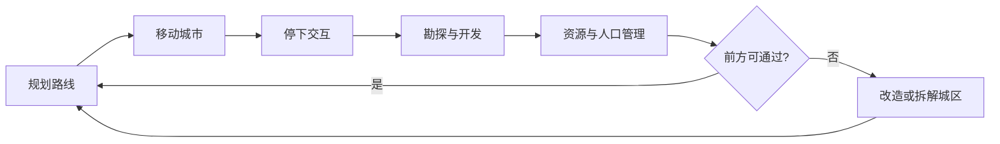

> 状态：草稿
> 校验状态：待校验
> 类型：对外展示
> 受众：新成员、合作方、宣传素材底稿

# 《循光之城》游戏介绍

> 命名说明：游戏名为《循光之城》，项目代码仓库与本地目录名为 **延续**。本文档是对外展示入口；机制与设定的完整细节见各专题文档。

## 这是什么游戏

《循光之城》是一款**资源管理 + 回合制策略**的模拟经营游戏。

**背景（一句）**：太阳过去固定不动，有日照的地方叫白昼，照不到的地方叫 [暗渊](04-设定/03-地点与场景/暗渊.md)。现在太阳开始向关外移动，后面的格子会逐渐变成暗渊。

**你做什么**：扮演 [模块化移动城市](02-系统设计/03-图层与地点/建筑层/城区总览.md) 的城主——每回合管理金属 / 食物 / 能源 / 人口，编组队伍勘探荒野，决定何时开拔、何时停下，必要时拆解或重组城区。离太阳太远或停太久，生存压力会上升。

**一句话**：驾驶可拆解重组的移动城市，跟着太阳在六边形地图上前进，在经营与取舍中撑到终局。

**类型与基调**：太阳朋克视觉 + 后启示录生存经营（艳阳、巨城、金色光带；背后是变暗的废土与资源压力）。详见 [核心世界观 · 世界风格与基调](04-设定/01-世界观/核心世界观.md#世界风格与基调)、[核心幻想](02-系统设计/01-核心体验/核心幻想.md)。

**平台与操作**：PC；3D 俯视六边形地图；鼠标点击指挥。默认镜头以主城为中心、朝向太阳，俯角 35°。详见 [平台与操作](02-系统设计/01-核心体验/平台与操作.md)。

## 世界观

机制与设定分文档维护，此处只列入口：

| 主题 | 说明 | 详细文档 |
|------|------|----------|
| 世界法则 | 太阳移动、暗渊、移动城市、荒野 | [世界概述](04-设定/01-世界观/世界概述.md) |
| 世界背景 | 日生文明、民众认知、势力格局 | [核心世界观](04-设定/01-世界观/核心世界观.md) |

**玩家侧摘要**：世上只有一座能整城移动的 [循烬城](04-设定/03-地点与场景/循烬城.md)。太阳往关外走，城市必须跟着走；停在太阳后面的区域，会慢慢变成暗渊。

## 你在做什么

### 玩家目标

| 阶段 | 目标 | 详细文档 |
|------|------|----------|
| 短期 | 维持[四种核心资源](02-系统设计/04-资源与人口/四种核心资源.md)平衡，让城市在当前区域生存并补给 | [四种核心资源](02-系统设计/04-资源与人口/四种核心资源.md) |
| 中期 | 通过[探索与扩张](02-系统设计/07-玩法循环/探索与扩张.md)点亮荒野、建立**采集设施**与驿站，扩张或重组城区以应对前方地形 | [探索与扩张](02-系统设计/07-玩法循环/探索与扩张.md)、[建筑层](02-系统设计/03-图层与地点/建筑层/README.md) |
| 长期 | 抵达终局目标并推进主线 | [胜利条件](02-系统设计/01-核心体验/胜利条件.md) |

### 胜利条件

终局目标与动态难度见 [胜利条件](02-系统设计/01-核心体验/胜利条件.md)（含追日阶段压力与第五章归塔提速）。

## 一局游戏怎么进行

游戏采用[回合制](02-系统设计/07-玩法循环/回合与行动表.md)推进：每回合先**玩家指挥**（编辑指令），再**玩家行动**（玩家城市必然最先行动），随后外部城市按种子顺序行动，最后环境结算。玩家为各单位规划跨回合指令表，并在行动表上安排本回合执行顺序。

| 时间尺度 | 玩家在做什么 | 详细文档 |
|----------|--------------|----------|
| 分钟级 | 观察资源与人口、调整城区与[队伍](02-系统设计/06-单位与交战/队伍系统.md)编制；在移动与停下之间切换；应对当回合事件 | [核心循环](02-系统设计/07-玩法循环/核心循环.md) |
| 小时级 | 选择前进方向、组织勘探、开发资源、规划城市形态、前往据点补给 | [核心循环](02-系统设计/07-玩法循环/核心循环.md) |
| 长期 | 跟着太阳推进、扩张城市能力、推进叙事与结局 | [核心循环](02-系统设计/07-玩法循环/核心循环.md)、[回合与行动表](02-系统设计/07-玩法循环/回合与行动表.md) |

## 核心机制一览

### 移动城市与城区

玩家的主城是**世上唯一一座**可整体移动的移动城市（循烬城）：占据多个正六边形格子，每格视为一个城区。城市由[核心区](02-系统设计/03-图层与地点/建筑层/连接与多核心.md)与多种城区类型组成，可分离、拆解、新建与重组——为通过狭窄地形，你可能需要牺牲部分模块。特殊地形会迫使玩家在「改造城市」与「放弃前进」之间做出取舍；移动与占格规则见 [地图与移动](02-系统设计/02-地图与世界/地图与移动.md)。

| 机制 | 要点 | 详细文档 |
|------|------|----------|
| 地图与移动 | 六边形网格、整城移动、停下后交互、地形通过限制 | [地图与移动](02-系统设计/02-地图与世界/地图与移动.md) |
| 城市模块化 | 核心区、连接与分离规则、城区类型 | [建筑层](02-系统设计/03-图层与地点/建筑层/README.md) |
| 地图图层 | 地形/环境/资源/建筑/设施/物品/单位多层叠加与响应 | [地图图层](02-系统设计/03-图层与地点/地图图层.md) |

### 资源与荒野

四类基础资源——金属、食物、能源、人口——驱动设施建造、城区运转、补给与城市编制。荒野格子上刷新 **矿藏、果地、遗迹、村镇** 等资源点，以及 **状态为废墟的城区**、 [外部城市](02-系统设计/05-城市与领袖/势力系统.md) 等 [建筑层](02-系统设计/03-图层与地点/地图图层.md#建筑层与城区) 内容（见 [荒野地点](02-系统设计/04-资源与人口/荒野地点.md)）。

| 资源 | 主要用途 | 详细文档 |
|------|------|----------|
| 金属 | 设施与城区的建造、修补、升级；资产生产 | [四种核心资源](02-系统设计/04-资源与人口/四种核心资源.md) |
| 食物 | 维持人口；远征队补给 | 同上 |
| 能源 | 激活并维持城区能力；维持部分设施运行；资产生产 | 同上 |
| 人口 | 分配工作、组建队伍 | 同上 |

### 探索、队伍与外部势力

城市停下后，可派出[勘探队、运输队、工程队](02-系统设计/06-单位与交战/队伍系统.md)探索荒野、运输物资，并在资源点上建立**征兵办、矿区、果园、能源站**等采集设施。荒野上的村镇（资源点）与外部城市提供人口与资源补给；外部城市以**城市领袖**为**领袖关系**主体，完成领袖委托一般可提升关系，同组织内其他领袖的关系会连带变化。

| 机制 | 要点 | 详细文档 |
|------|------|----------|
| 队伍系统 | 勘探队、运输队、工程队及职责 | [队伍系统](02-系统设计/06-单位与交战/队伍系统.md) |
| 探索与扩张 | 勘探、建设设施、前往据点 | [探索与扩张](02-系统设计/07-玩法循环/探索与扩张.md) |
| 外部城市与组织 | 外部城市构成、领袖关系、组织传导 | [势力系统](02-系统设计/05-城市与领袖/势力系统.md) |

## 核心体验

- **规划与取舍**：扩建、分离、加速都要权衡当下和未来。
- **持续加压**：离太阳越远，环境越严；系统会推着你往太阳方向走。
- **牺牲模块**：城市可以拆、可以弃，决策会直接反映在城区拓扑上。

详见 [核心幻想](02-系统设计/01-核心体验/核心幻想.md)。

## 参考作品

| 作品 | 可借鉴点 |
|------|----------|
| 《冰汽时代》 | 末日城市经营、道德与资源取舍 |
| 《无光之海》 | 探索未知、叙事驱动、压抑氛围 |
| 《文明6》 | 回合制策略、区域扩张与长期规划 |

## 详细文档索引

以下索引供深入阅读；当前各专题文档 `状态` 均为**草稿**、`校验状态` 均为**未校验**，内容可能随设计迭代调整。

### 核心体验

| 文档 | 说明 |
|------|------|
| [核心幻想](02-系统设计/01-核心体验/核心幻想.md) | 一句话卖点、关键词、玩家目标、情绪曲线 |
| [胜利条件](02-系统设计/01-核心体验/胜利条件.md) | 游戏类型、核心体验、胜利条件、动态难度 |

### 玩法循环

| 文档 | 说明 |
|------|------|
| [核心循环](02-系统设计/07-玩法循环/核心循环.md) | 分钟级 / 小时级 / 长期三级循环 |
| [回合与行动表](02-系统设计/07-玩法循环/回合与行动表.md) | 回合阶段、行动表、指令队列、环境结算 |

### 核心系统

| 文档 | 说明 |
|------|------|
| [地图与移动](02-系统设计/02-地图与世界/地图与移动.md) | 六边形地图、移动城市占格与移动规则 |
| [地图图层](02-系统设计/03-图层与地点/地图图层.md) | 多层格子内容、影响规则、响应机制 |
| [队伍系统](02-系统设计/06-单位与交战/队伍系统.md) | 勘探队、运输队、工程队 |
| [探索与扩张](02-系统设计/07-玩法循环/探索与扩张.md) | 停下后的勘探、建设与据点交互 |
| [势力系统](02-系统设计/05-城市与领袖/势力系统.md) | 外部城市、领袖关系与组织传导 |

### 资源与城市

| 文档 | 说明 |
|------|------|
| [四种核心资源](02-系统设计/04-资源与人口/四种核心资源.md) | 金属、食物、能源、人口 |
| [荒野地点](02-系统设计/04-资源与人口/荒野地点.md) | 村镇、矿藏、果地、遗迹与采集设施 |
| [建筑层](02-系统设计/03-图层与地点/建筑层/README.md) | 城区、核心区、分离与重组 |

### 世界观设定

| 文档 | 说明 |
|------|------|
| [世界概述](04-设定/01-世界观/世界概述.md) | 摘要、核心法则速览、主要势力 |
| [核心世界观](04-设定/01-世界观/核心世界观.md) | 世界背景、民众认知、地理与势力 |

### 章节结构（对外索引）

游戏分为五章，逐步推进：

| 章节 | 名称 | 核心体验 |
|------|------|----------|
| 一 | 初速度 | 启程追逐，首次开拔 |
| 二 | 角速度 | 太阳加速，速度差拉大带来的无力感 |
| 三 | 离心力 | 反向冲锋，进入暗渊 |
| 四 | 摩擦力 | 救援抉择，牺牲与延续 |
| 五 | 向心力 | 归轨提速，揭示真相 |

> 详细章节设计、揭示层级、真相内容为内部母本，见 [04-设定/05-隐秘真相/](04-设定/05-隐秘真相/)，**不**写入对外文档。

### 程序实现（面向开发）

| 文档 | 说明 |
|------|------|
| [模块划分](03-程序设计/01-架构总览/模块划分.md) | 运行时模块架构 |
| [数据字典](03-程序设计/03-数据字典/README.md) | 数据表与字段 |

## 修订记录

| 日期 | 版本 | 说明 |
|------|------|------|
| 2026-06-21 | 0.0.1 | 初稿：对外展示入口，汇总游戏介绍并链向各专题文档；对外表述统一为「太阳」；补全校验状态元数据；隐秘真相不纳入对外索引 |
| 2026-06-22 | 0.0.2 | 新增章节结构索引、暗渊概念引用 |
| 2026-06-23 | 0.0.3 | 章节结构索引同步五章定名：初速度、角速度、离心力、摩擦力、向心力；刷新图片 |
| 2026-06-24 | 0.0.4 | 世界背景改为先讲长期固定不变的太阳，再讲太阳移动的异常事件 |
| 2026-06-24 | 0.0.5 | 用更自然流畅的语言重写游戏介绍 |
| 2026-06-24 | 0.0.6 | 明确世界分为永恒的白昼与永恒的暗渊 |
| 2026-06-24 | 0.0.7 | 用更具史诗感的语言润色世界观表述 |
| 2026-06-24 | 0.0.8 | 强调太阳移动和世界被吞没是正在进行的过程 |
| 2026-06-24 | 0.0.9 | 参考作品改为冰汽时代、无光之海、文明6 |
| 2026-06-27 | 0.1.0 | 重构：更新系统设计文档路径，对齐新目录结构 |
| 2026-07-11 | 0.2.0 | **策划口吻重写开头**；去掉失照 / X即Y / 史诗腔；世界观节改为索引 + 一句摘要 |
