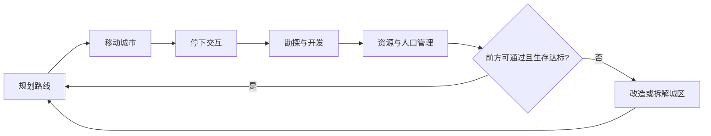

> 状态：草稿  
> 校验状态：待校验  
> 类型：对内全景介绍  
> 受众：新成员、跨职能对齐、需要「一次读完项目要点」的读者  

← [文档库](./README.md)

# 《循光之城》项目总览

本文是**对内全景介绍**：用一篇文稿串起主题、体验、玩法、世界观、章节、工程与文档分工。  
机制细则以 [02-系统设计](./02-系统设计/) 为准，设定以 [04-设定](./04-设定/) 为准，实现以 [03-程序设计](./03-程序设计/) 为准。


| 相关文稿                                     | 分工                    |
| ---------------------------------------- | --------------------- |
| [游戏介绍.md](./游戏介绍.md)                     | **对外**短介绍与索引          |
| [01-草稿/循光之城-策划案.md](./01-草稿/循光之城-策划案.md) | **对内 pitch**（卖点与体验优先） |
| **本文**                                   | **对内全景**（要点写全、链到权威）   |


---

## 1. 项目是什么


| 项            | 内容                                     |
| ------------ | -------------------------------------- |
| **游戏名**      | 《循光之城》                                 |
| **项目 / 仓库名** | **延续**（本地目录与代码仓库）                      |
| **类型**       | 资源管理 + 回合制策略的模拟经营                      |
| **画面**       | **3D 俯视角**（策略向浅俯视，默认约 35°）；玩法逻辑基于六边形格  |
| **地图**       | **矩形**范围内的**正六边形格棋盘**（四向有界；宽度 / 长度可配置） |
| **平台与操作**    | PC；鼠标点击为主；默认镜头以主城为中心、**朝向地面**          |
| **视觉基调**     | 太阳朋克 + 后启示录：艳阳、巨城、金色光带，对照正在被吞没的废土      |


你扮演末日废土上**唯一**可整城迁徙的移动城邦——[循烬城](./04-设定/03-地点与场景/循烬城.md)——的城主：拼接与拆解城区、调度四种核心资源、派遣队伍、周旋势力，在太阳远去的世界里为文明争得一线生机。

---

## 2. 主题

**延续**——**延续传承、延续文明**。


| 层        | 含义                 | 玩法 / 叙事落点                          |
| -------- | ------------------ | ---------------------------------- |
| **延续传承** | 城主身份、势力记忆、章节真相逐步揭开 | 关系经营、剧情事件、[隐秘真相](./04-设定/05-隐秘真相/) |
| **延续文明** | 日生文明不被暗渊吞没；城市仍能前进  | 追日 / 入暗渊、资源与城区取舍、终局归塔提速太阳          |


---

## 3. 一句话（对内完整版）

在《循光之城》中，你将成为末日废土上唯一移动城邦的城主。驾驶这座可拼接、可拆解的模块化城市，在太阳原本固定不动的奇异世界，追逐那轮本该荣光永驻、却不知为何而远去的太阳。

你需要不断对**资源调度、部队派遣、城市管理与路线规划**做出决策，并承受对应的奖励与后果；同时周旋于各方势力，在交易与交锋中寻得一条前路，为你钟爱的文明争得一线生机。

追逐太阳、免于被黑暗吞噬，是日生文明唯一的生路，也是你揭开世界真相的道途。

机制侧更短的表述见 [核心幻想](./02-系统设计/01-核心体验/核心幻想.md)。

---

## 4. 核心体验（三条并行）

### 4.1 夹缝中求生的经营体验

指挥城市逃离不断逼近、吞噬生存空间、且越来越快的暗渊；同时应对资源不足与势力纠缠。

- **第一、二章**：同向追日；相对太阳距离拉近偏奖励、拉远偏惩罚；第二章起速度差拉大。  
- **第三章起**：全局暗渊；太阳移动停用；压力改由常驻环境与章节目标驱动（分章细则部分待定）。  
- 权威：[胜利条件 · 动态难度](./02-系统设计/01-核心体验/胜利条件.md#动态难度)、[地图与移动 · 太阳照射与停用](./02-系统设计/02-地图与世界/地图与移动.md#太阳照射区与移动停用)。

### 4.2 在建设与自毁之间取舍的体验

更多城区 → 更强能力，也更慢、更耗资源。为不被暗渊追上，必须取舍——拆开城区、拆掉结构、甚至航行中丢掉模块。


| 动作          | 要点                                                             |
| ----------- | -------------------------------------------------------------- |
| 拼接 / 建设     | 花费金属与人口；城区变多后，航行时负载更重                                          |
| **迁移城区**    | 城市**停泊**时，把仍连在主城上的城区挪到城廓内另一格；要花**多个回合**做工作，不断开连接               |
| **分离城区**    | 把城区从主城**拆开**，留在地图上、不再随城移动；**停泊**时用多回合工作拆开（不伤结构）；**航行**中强行拆开见下行 |
| **主动拆解**    | 故意拆掉建筑结构：完整度 −10%，回收 **10** 金属                                 |
| **航行中放弃城区** | 航行时立刻拆开；**脱离的城区**结构完整度各降 **40%**                               |
| 负载 / 交战损伤   | 航行负载或交战使结构变差；停泊后用金属修复                                          |


权威：[分离与拆解](./02-系统设计/03-图层与地点/建筑层/分离与拆解.md)、[城区总览 · 负载成本](./02-系统设计/03-图层与地点/建筑层/城区总览.md#负载成本)。

### 4.3 参与剧情的沉浸式体验

旅途中遭遇事件与势力，逐步理解世界观，并对城主身份产生认同。玩法终局是抵达渊光 / 指挥塔并为太阳提速；叙事动机（守誓与补救）见设定母本，不替代通关判定。

玩家交互心智（目标 / 行为 / 障碍 / 奖励）：[交互链-循光之城](./01-草稿/交互链-循光之城.md)。

---

## 5. 世界观骨架

### 5.1 玩家侧可知

- 世界曾有**固定不动的太阳**：有日照为白昼，照不到的地方为 [暗渊](./04-设定/03-地点与场景/暗渊.md)。  
- 游戏中，太阳开始移动；落在后面的区域逐渐失去日照，变成暗渊。  
- 玩家带领着一座能整城移动的城市： [循烬城](./04-设定/03-地点与场景/循烬城.md)。跟着太阳走，是日生文明的生路。  
- 民众认知与势力格局：[核心世界观](./04-设定/01-世界观/核心世界观.md)；法则速览：[世界概述](./04-设定/01-世界观/世界概述.md)。

### 5.2 内部设定分层


| 层    | 内容                    | 入口                           |
| ---- | --------------------- | ---------------------------- |
| 民众可知 | 追日求生、势力传闻             | `04-设定/01`～`03`              |
| 隐秘真相 | 太阳真相、骄阳之心、城主真实身份、章节揭示 | [05-隐秘真相/](./04-设定/05-隐秘真相/) |


对外材料用 [游戏介绍.md](./游戏介绍.md)；隐秘真相勿写入宣传稿。

---

## 6. 一局游戏怎么进行

### 6.1 三个时间尺度

玩家同时在三档时间跨度上做决策（见 [核心循环](./02-系统设计/07-玩法循环/核心循环.md)）：


| 尺度 | 大约多久 | 玩家在做什么 |
| ---- | -------- | ------------ |
| **短期** | 数回合内 | 本回合下达指令；查看资源与人口；调整队伍编制；处理眼前事件（短缺、阻挡、遭遇等） |
| **中期** | 十数回合 | 给单位安排跨多回合的任务；勘探与开发；规划城区怎么拼、怎么拆，好通过前方地形 |
| **长期** | 整局 | 追日或转入暗渊；扩张城市能力；推进五章主线与终局 |


### 6.2 一轮活动循环

**在当前位置经营 → 确认生存 → 移动至新位置**，再进入下一轮。




当前位置经营时，注意力在六面之间分配：**路线规划 · 城市经营 · 资源管理 · 关系经营 · 指挥战棋 · 情报勘探**。详见 [核心循环](./02-系统设计/07-玩法循环/核心循环.md)、[交互链](./01-草稿/交互链-循光之城.md)。

### 6.3 每回合四阶段

1. **玩家指挥**（编辑指令表 / 行动表）
2. **玩家行动**（主城必然最先）
3. **外部城市 AI**
4. **环境结算**（含第 7、14… 回合的**周总结**粮食）

权威：[回合与行动表](./02-系统设计/07-玩法循环/回合与行动表.md)。  
草稿图示：[游戏流程详情图](./01-草稿/游戏流程详情图.md)。

---

## 7. 大地图与移动


| 要点       | 说明                                                |
| -------- | ------------------------------------------------- |
| **形态**   | **矩形**棋盘上的**正六边形格**；上、下、左、右均有边界（宽度约 20～30 格，长度待定） |
| **主轴**   | 纵向为追日 / 入暗渊主方向（第一、二章向上，第三至五章向下）                   |
| **占格**   | 移动城市多格 footprint；每格可对应城区                          |
| **停泊**   | 座落棋盘占格；队伍可进出；可占格建设；禁用整城移动                         |
| **航行**   | 不占棋盘格；禁进出与占格建设；可沿纵向行进                             |
| **切换**   | 停泊↔航行各占 **1** 回合（核心区工作）                           |
| **迁移城区** | 仅**停泊**时可做：把仍连着的城区挪到城廓内另一格（多回合工作；不断开连接）           |
| **图层栈**  | 地形 → 环境 → 资源 → 建筑 → 设施 → 物品 → 单位                  |


权威：[地图与移动](./02-系统设计/02-地图与世界/地图与移动.md)、[地图图层](./02-系统设计/03-图层与地点/地图图层.md)、[平台与操作](./02-系统设计/01-核心体验/平台与操作.md)。

---

## 8. 城市：模块化城区

- 城市由**核心区**与多种城区组成，可连接、分离、修复、拆解、重组。  
- **特殊城区**带城区能力，例如：巨炮、通讯站（城市 / 单位视野）、学院、城坞（修复效率）。一般城区以设施与工作区为主。  
- **住宅承载**：城区基础 **50**；[屋舍](./02-系统设计/03-图层与地点/设施层.md) 每座 **+15**（可累加）。  
- **负载成本**：航行时按占格结算完整度损伤（如每 3 格 −2%/区）；用金属修复。  
- **交战承伤**：结构减免 → 结构承伤 → 损伤累计；剩余伤害打人口，再传导关系到资源修复。

权威：[建筑层](./02-系统设计/03-图层与地点/建筑层/README.md)、[连接与多核心](./02-系统设计/03-图层与地点/建筑层/连接与多核心.md)、[城市管理系统](./02-系统设计/04-资源与人口/城市管理系统.md)、[运作与居民 · 城区能力](./02-系统设计/03-图层与地点/建筑层/运作与居民.md#城区能力被动--主动)。

---

## 9. 四种核心资源


| 资源     | 用途             | 典型来源         |
| ------ | -------------- | ------------ |
| **金属** | 建造、修补、升级、资产生产  | 矿区；主动拆解回收    |
| **食物** | 维持人口；外出队伍靠**载荷**带粮（周总结从载荷扣） | 果园 → 后期温室    |
| **能源** | 城区日常、能力激活、温室转化 | 能源站（遗迹）      |
| **人口** | 居民、运作劳动力、编组    | 征兵办（村镇）；外部城市 |


产出与消耗共用 **3 回合**节拍；工作量 **30** ≈ 满编工程队一拍。权威细则：[四种核心资源](./02-系统设计/04-资源与人口/四种核心资源.md)。

### 9.1 产出锚（首版）


| 设施  | 单次              | 建造金属 |
| --- | --------------- | ---- |
| 果园  | 25 食物           | 30   |
| 温室  | 150 食物（耗 50 能源） | 80   |
| 矿区  | 25 金属           | 30   |
| 能源站 | 40 能源           | 30   |
| 征兵办 | 15 人            | 30   |
| 屋舍  | +15 承载          | 20   |


### 9.2 消耗锚（首版）

#### 能源 · 日常开销

工作区开启时，**每 3 回合**结算一次（核心区不可关闭）：


| 模块   | 每 3 回合 | 约合周耗 | 备注        |
| ---- | ------ | ---- | --------- |
| 核心区  | 15     | ~35  | 城市保底耗能    |
| 通讯站  | 10     | ~23  | 维持被动视野    |
| 学院   | 8      | ~19  | 维持被动      |
| 城坞   | 10     | ~23  | 开启时       |
| 巨炮   | —      | 0    | 仅开火时扣激活费  |


**激活（单次）**：通讯站主动视野 **20** 能源；巨炮开火 **80** 能源 + **40** 金属。

**覆盖感**：前期约 4 区（仅核心 + 通讯站）≈ **58** 能源/周 → 1 座能源站专精可覆盖；后期加温室后通常要 2～4 座能源站。

#### 金属 · 负载、修复与拆解


| 项        | 首版默认                         |
| -------- | ---------------------------- |
| 航行负载     | 每前进 **3** 格，各连接城区完整度 **−2%** |
| 修复单价     | **2** 金属 / **1%** 完整度        |
| 修复工作     | 工作量 30；恢复 **10%**；扣 **20** 金属 |
| 主动拆解     | 完整度 **−10%**；回收 **10** 金属     |
| 航行放弃城区   | **脱离的城区**完整度 **−40%**；**不**回收金属 |
| 被动损伤（负载等） | **不**回收金属                      |


**航行例**（4 城区满编，航行 12 格）：4 步 × 4 区 × 4 金属当量 = **64** 金属待修；约 2 座矿区专精可覆盖一趟中距航行的修复囤积。

**首版不定**：整城移动额外即时耗能 / 耗金属——**关闭**；只走负载损伤 → 停泊后用金属修复。

#### 人口 · 占用

人口**不因**日常工作或编组而从总量里「扣掉」；消耗侧主要是**占用**三类名额（见 [人口与迁移](./02-系统设计/04-资源与人口/人口与迁移.md)）：


| 占用什么 | 规则 | 首版默认 / 举例 |
| -------- | ---- | -------------- |
| **住宅承载** | 居民安置在城区；编组外出**仍占**来源城区住宅，**不**算从住宅迁出 | 每城区基础 **50**；[屋舍](./02-系统设计/03-图层与地点/设施层.md) 每座 **+15**（可累加） |
| **运作人力** | 工作区开启时，须有指定类型人口上岗，维持城区 / 设施运转 | 见下举例；各区最低人数与类型名单 sy-23 / sy-25 待补 |
| **队伍编制** | 创队 / 补员从人口池**占用编制**；人员仍归属住宅所在城区 | 见下举例；人数影响视野、效率、战力（**不**影响移速） |


**运作人力举例**（工作区开启才占用上岗名额；关闭则释放运作占用，仍可占住宅）：

- **通讯站**：配好人口并开启 → 付日常能源，被动给己方城市视野 **+2** 格；人不够则**拒开**；开启后跌破最低需求则**停摆**。  
- **核心区**：工作区**恒开**，同样要运作人口上岗（不可关以省人力）。  
- **一般城区设施**：果园 / 矿区 / 能源站 / 温室等**每座设施 = 一座工作区**；上岗后才按 3 回合节拍产出（温室另耗能源）。

**队伍编制举例**（表中人数 = **默认人数 = 编制上限**；创队可少于该数，至少 1 人；人数比分母同此值）：


| 队伍   | 编制人数 | 占用感 |
| ---- | ---- | --- |
| 侦察队  | **3**  | 外出探路、点亮视野 |
| 勘探队  | **5**  | 精确勘察资源点储量 |
| 工程队  | **10** | 满编专精约一拍完成工作量 **30**（建造 / 修复等） |
| 运输队  | **15** | 城与资源点之间运货；人数越低负载上限越低 |
| 民兵   | **15** | 交战战力随人数比下降 |
| 步兵 / 弓手 | **10** | 交战战力随人数比下降 |


例：派出 **1** 支满编工程队 = 占用 **10** 编制，这 10 人**仍占**来源城区住宅；解散或减员后才释放编制（住宅随迁出 / 减员另计）。

**队伍载荷与粮食（外派约束）**：外出队伍**不**从城仓按回合扣粮；周总结时从**本队载荷**分粮。

| 项 | 规则 |
| -- | ---- |
| **需求** | 编制 + 随行人员，各 **1** 粮食 / 人 / 周（从本队载荷扣） |
| **分池** | 城仓与各队载荷**独立**；编制吃载荷粮，**不算**城区仓库切分，但仍占住宅 |
| **续航目标** | 默认载荷约能维持 **3** 个周期（具体容量数值 sy-21 待补） |
| **不够时** | 未分到 → 半数减员；长期外派须 **运输队** 从城市向野外队伍送粮（细则 sy-21） |

例：满编工程队 **10** 人、无随行 → 每周约需载荷里 **10** 粮食；约 3 周续航则出发前大约要备 **30** 粮食（随行、半编按实有人数计）。

**真正会减人口总量的**：交战 / 事件损失，以及**周总结**时未分到粮食 → 半数减员（城内见 §9.3；队内见上表）。

### 9.3 仓储与粮食

- **仓储**：金属、食物、能源共用同一份容量（1:1 占用）；人口走**住宅承载**（见 §9.2），不占仓库；**队伍载荷与城仓分池**（外派约束见 §9.2）；可用 **仓库** 设施扩容（容量数值 sy-23 待补）。  
- **周总结**：每 7 回合环境行动后结算粮食；城内未分到者半数减员；外出队伍从**本队载荷**结算（同上）。规则见 [粮食与周总结](./01-草稿/归档/粮食与周总结/README.md)。  
- **荒野点**：果地 / 矿藏 / 遗迹 / 村镇 → 对应采集设施。[荒野地点](./02-系统设计/04-资源与人口/荒野地点.md)。

---

## 10. 队伍、视野与交战


| 主题        | 要点                                                                 |
| --------- | ------------------------------------------------------------------ |
| **队伍**    | 勘探 / 运输 / 工程等；占用编制但仍占住宅；人数影响视野、效率、战力（不含移速）；**外派受载荷粮食约束**（约 3 周续航，见 §9.2） |
| **视野与情报** | 资源点三级揭示；**他人城市**经单位视野发现后**记入**地图；**他人单位**仅在视野内实时可见，离开后不保留            |
| **交战**    | 回合战棋；结构承伤与人口损失分轨；关系事件当场结算                                          |


权威：[队伍系统](./02-系统设计/06-单位与交战/队伍系统.md)、[单位类型与视野](./02-系统设计/06-单位与交战/单位类型与视野.md)、[通讯与视野系统 · 实体揭示](./02-系统设计/06-单位与交战/通讯与视野系统.md#他人城市与他人单位)、[交战系统](./02-系统设计/06-单位与交战/交战系统.md)。

---

## 11. 势力、领袖与外交

- 外部城市以**城市领袖**为关系主体；委托、贸易、站队影响关系。  
- **招募 → 未效忠 → 效忠** 与 **占领** 分轨；无人口占格可为**接管**。  
- **村镇**：资源点；经征兵办提取无归属人口。  
- 权威：[势力系统](./02-系统设计/05-城市与领袖/势力系统.md)、[领袖与势力](./02-系统设计/05-城市与领袖/领袖与势力.md)。

---

## 12. 五章叙事弧（玩法向）


| 章   | 名称  | 行进  | 指定目标感 | 结束于（地理）       |
| --- | --- | --- | ----- | ------------- |
| 一   | 初速度 | 向上  | 太阳    | 穿越铁门关，入荒地     |
| 二   | 角速度 | 向上  | 太阳    | 铁巢终局；转向暗渊     |
| 三   | 离心力 | 向下  | 渊光    | 日生之地（当时无日照）   |
| 四   | 摩擦力 | 向下  | 渊光    | 回到玩家起点一带      |
| 五   | 向心力 | 向下  | 指挥塔   | 渊光城 / 渊光；提速太阳 |


玩法侧重见 [核心循环 · 章节](./02-系统设计/07-玩法循环/核心循环.md)；故事与揭示见 [章节划分与故事大纲](./04-设定/05-隐秘真相/章节划分与故事大纲.md)（内部母本）。

**玩法终局**：抵达渊光 / 指挥塔，集齐骄阳之心并为太阳提速。[胜利条件](./02-系统设计/01-核心体验/胜利条件.md)。

---

## 13. 乐趣与设计参考

**沉浸感（对齐《IXION》）**：在场景与剧情节拍中，看见城区形态、路线、资源结余与势力关系，共同塑造一座仍在前进的城市。

**本作张力**：太阳朋克对照废土；亲手拆掉自己建的城区的悲壮感（《冰汽时代》式压力，载体是城市拓扑）；回合策略的长期规划感（《文明》）。


| 作品      | 落点           |
| ------- | ------------ |
| 《文明六》   | 回合规则、扩张与长期规划 |
| 《IXION》 | 方舟叙事、经营成果可见  |
| 《冰汽时代》  | 末日经营、道德取舍    |
| 《无光之海》  | 探索未知、压抑叙事    |


---

## 14. 文档库与工程分工

```
延续/
├── Assets/           ← Unity 资源（建议 UVC/Plastic）
├── Docs/             ← 本目录（建议 Git）
├── ProjectSettings/
└── ...
```


| 目录                       | 回答的问题                               |
| ------------------------ | ----------------------------------- |
| [00-规范/](./00-规范/)       | 写法约定、待细化追踪、SO 规范                    |
| [01-草稿/](./01-草稿/)       | 脑暴与 pitch；已收敛对照见 [归档/](./01-草稿/归档/) |
| [02-系统设计/](./02-系统设计/)   | 玩法规则**理应**怎样                        |
| [03-程序设计/](./03-程序设计/)   | 表、判定、架构**如何**实现                     |
| [04-设定/](./04-设定/)       | 故事与背景                               |
| [99-备份与归档/](./99-备份与归档/) | 旧方案归档                               |


设计意图与实现**成对**维护，双向链接。开放项分轨：[系统 sy](./00-规范/待细化追踪-系统.md) · [程序 sf](./00-规范/待细化追踪-程序.md) · [设定 st](./00-规范/待细化追踪-设定.md)。

---

## 15. 程序侧入口（开发）


| 主题    | 入口                                                        |
| ----- | --------------------------------------------------------- |
| 模块架构  | [模块划分](./03-程序设计/01-架构总览/模块划分.md)                         |
| 数据字典  | [03-数据字典/](./03-程序设计/03-数据字典/)                            |
| 运行时逻辑 | [02-运行时逻辑/](./03-程序设计/02-运行时逻辑/)                          |
| 设计缺口  | [设计缺口清单](./03-程序设计/设计缺口清单.md)                             |
| 配置原则  | 参数走 SO；程序只做能力通道（见 [SO 配置与能力通道规范](./00-规范/SO配置与能力通道规范.md)） |


系统设计总览树（草稿）：[系统设计详情图](./01-草稿/系统设计详情图.md)。

---

## 16. 首版数值与规则摘要


| 主题      | 要点                                                        |
| ------- | --------------------------------------------------------- |
| 产出 / 消耗 | 见 **§9**（产出锚、能源日常与激活、负载修复、拆解 / 放弃）                        |
| 仓储      | 金属+食物+能源共用容量；仓库设施扩容                                       |
| 粮食      | 每 7 回合周总结；未分到 → 半数减员                                      |
| 停泊 / 航行 | 切换各 1 回合                                                  |
| 关系      | 事件当场结算                                                    |
| 视野揭示    | 他人城市记入地图；他人单位仅实时可见                                        |


细则见各专题文档；开放项见待细化追踪。

---

## 17. 建议阅读顺序

1. 本文（建立全景）
2. [策划案](./01-草稿/循光之城-策划案.md)（强化卖点与体验措辞）
3. [核心幻想](./02-系统设计/01-核心体验/核心幻想.md) → [胜利条件](./02-系统设计/01-核心体验/胜利条件.md) → [核心循环](./02-系统设计/07-玩法循环/核心循环.md)
4. 按需深入：地图 → 建筑层 → 资源 → 势力 → 单位 → 回合
5. 叙事：[世界概述](./04-设定/01-世界观/世界概述.md) → [章节大纲](./04-设定/05-隐秘真相/章节划分与故事大纲.md)
6. 开发：[模块划分](./03-程序设计/01-架构总览/模块划分.md) → 数据字典

---

## 修订记录


| 日期         | 版本    | 说明                                     |
| ---------- | ----- | -------------------------------------- |
| 2026-07-11 | 0.2.13 | §9.2 / §10 补队伍载荷粮食约束（约 3 周续航）              |
| 2026-07-11 | 0.2.12 | 队伍编制：默认人数 = 编制上限                         |
| 2026-07-11 | 0.2.11 | §9.2 运作人力 / 队伍编制补举例                         |
| 2026-07-11 | 0.2.10 | §9.2 消耗锚补人口占用（住宅 / 运作 / 编制）              |
| 2026-07-11 | 0.2.9 | 时间尺度正式用语改为 **短期 / 中期 / 长期**（废止分钟级 / 小时级） |
| 2026-07-11 | 0.2.8 | §9 写入消耗锚详情；§16 产出/消耗改指 §9                     |
| 2026-07-11 | 0.2.7 | §6.1 时间尺度改白话，并标明跨度与权威用语对照           |
| 2026-07-11 | 0.2.6 | 航行放弃 −40%：仅**脱离的城区**（非该次涉及全部）          |
| 2026-07-11 | 0.2.5 | 正式用语：城区占格迁移 → **迁移城区**                 |
| 2026-07-11 | 0.2.4 | §4.2 分离与迁移城区改用白话；拆开与挪位分列               |
| 2026-07-11 | 0.2.3 | 默认镜头朝向地面                               |
| 2026-07-11 | 0.2.2 | 他人城市记入地图、他人单位仅实时揭示                     |
| 2026-07-11 | 0.2.1 | 地图改为矩形六边形格棋盘；画面明确为 3D 俯视角              |
| 2026-07-11 | 0.2.0 | 全文只写现行机制；去掉废止对照式措辞；特殊城区并列举例；§16 改为首版摘要 |
| 2026-07-11 | 0.1.2 | 介绍文口径收束                                |
| 2026-07-11 | 0.1.0 | 初稿                                     |


