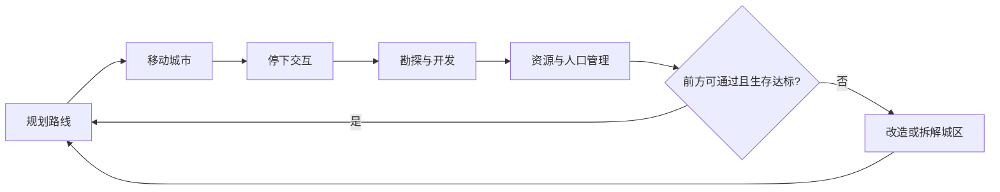

> 状态：草稿  
> 校验状态：待校验  
> 类型：对内全景介绍  
> 受众：新成员、跨职能对齐、需要「一次读完项目要点」的读者  

← [文档库](./README.md)

# 《循光之城》项目总览

本文是**对内全景介绍**：用一篇文稿串起主题、体验、玩法、世界观、章节、工程与文档分工。  
**不**替代专题细则——机制以 [02-系统设计](./02-系统设计/) 为准，设定以 [04-设定](./04-设定/) 为准，实现以 [03-程序设计](./03-程序设计/) 为准。

| 相关文稿 | 分工 |
|----------|------|
| [游戏介绍.md](./游戏介绍.md) | **对外**短介绍与索引 |
| [01-草稿/循光之城-策划案.md](./01-草稿/循光之城-策划案.md) | **对内 pitch**（卖点与体验优先） |
| **本文** | **对内全景**（要点写全、链到权威） |

---

## 1. 项目是什么

| 项 | 内容 |
|----|------|
| **游戏名** | 《循光之城》 |
| **项目 / 仓库名** | **延续**（本地目录与代码仓库） |
| **类型** | 资源管理 + 回合制策略的模拟经营 |
| **平台与操作** | PC；3D 俯视六边形地图；鼠标点击为主；默认镜头以主城为中心、朝向太阳，俯角约 35° |
| **视觉基调** | 太阳朋克 + 后启示录：艳阳、巨城、金色光带，对照正在被吞没的废土 |

你扮演末日废土上**唯一**可整城迁徙的移动城邦——[循烬城](./04-设定/03-地点与场景/循烬城.md)——的城主：拼接与拆解城区、调度四种核心资源、派遣队伍、周旋势力，在太阳远去的世界里为文明争得一线生机。

---

## 2. 主题

**延续**——**延续传承、延续文明**。

| 层 | 含义 | 玩法 / 叙事落点 |
|----|------|-----------------|
| **延续传承** | 城主身份、势力记忆、章节真相逐步揭开 | 关系经营、剧情事件、[隐秘真相](./04-设定/05-隐秘真相/) |
| **延续文明** | 日生文明不被暗渊吞没；城市仍能前进 | 追日 / 入暗渊、资源与城区取舍、终局归塔提速太阳 |

---

## 3. 一句话（对内完整版）

在《循光之城》中，你将成为末日废土上唯一移动城邦的城主。驾驶这座可拼接、可拆解的模块化城市，在太阳原本固定不动的奇异世界，追逐那轮本该荣光永驻、却不知为何而远去的太阳。

你需要不断对**资源调度、部队派遣、城市管理与路线规划**做出决策，并承受对应的奖励与后果；同时周旋于各方势力，在交易与交锋中寻得一条前路，为你钟爱的文明争得一线生机。

追逐太阳、免于被黑暗吞噬，是日生文明唯一的生路，也是你揭开世界真相的道途。

机制侧更短的表述见 [核心幻想](./02-系统设计/01-核心体验/核心幻想.md)。

---

## 4. 核心体验（三条并行）

### 4.1 夹缝中求生的经营体验

指挥城市逃离不断逼近、吞噬生存空间、且越来越快的暗渊；同时应对资源不足与势力纠缠。

- **第一、二章**：同向追日；相对太阳距离拉近偏奖励、拉远偏惩罚；第二章起速度差拉大。  
- **第三章起**：全局暗渊；太阳移动停用；压力改由常驻环境与章节目标驱动（分章细则部分待定）。  
- 权威：[胜利条件 · 动态难度](./02-系统设计/01-核心体验/胜利条件.md#动态难度)、[地图与移动 · 太阳照射与停用](./02-系统设计/02-地图与世界/地图与移动.md#太阳照射区与移动停用)。

### 4.2 在建设与自毁之间取舍的体验

更多城区 → 更强能力，也更慢、更耗资源。为不被暗渊追上，必须取舍——分离、拆解、甚至航行放弃自己建过的城区。

| 动作 | 要点 |
|------|------|
| 拼接 / 建设 | 付金属与人口；负载上升 |
| 分离 / 占格迁移 | 停泊多回合；布局与完整度代价 |
| **主动拆解** | 完整度 −10% / 回收 **10** 金属（鼓励修而非拆） |
| **航行放弃** | 即时；完整度 **−40%**；**不**回收金属 |
| 负载 / 交战损伤 | 完整度下降；**不**回收金属 |

权威：[分离与拆解](./02-系统设计/03-图层与地点/建筑层/分离与拆解.md)、[城区总览 · 负载成本](./02-系统设计/03-图层与地点/建筑层/城区总览.md#负载成本)。

### 4.3 参与剧情的沉浸式体验

旅途中遭遇事件与势力，逐步理解世界观，并对城主身份产生认同。玩法终局是抵达渊光 / 指挥塔并为太阳提速；叙事动机（守誓与补救）见设定母本，不替代通关判定。

玩家心智链（目标 / 行为 / 障碍 / 奖励）：[交互链-循光之城](./01-草稿/交互链-循光之城.md)。

---

## 5. 世界观骨架

### 5.1 玩家侧可知

- 世界曾有**固定不动的太阳**：有日照为白昼，照不到为 [暗渊](./04-设定/03-地点与场景/暗渊.md)。  
- 太阳开始向关外移动；落在后面的区域逐渐失去日照，变成暗渊。  
- 世上只有一座能整城移动的 [循烬城](./04-设定/03-地点与场景/循烬城.md)。跟着太阳走，是日生文明的生路。  
- 民众认知与势力格局：[核心世界观](./04-设定/01-世界观/核心世界观.md)；法则速览：[世界概述](./04-设定/01-世界观/世界概述.md)。

### 5.2 内部设定分层（勿对外混写）

| 层 | 内容 | 入口 |
|----|------|------|
| 民众可知 | 追日求生、势力传闻 | `04-设定/01`～`03` |
| 隐秘真相 | 太阳真相、骄阳之心、城主真实身份、章节揭示 | [05-隐秘真相/](./04-设定/05-隐秘真相/) |

---

## 6. 一局游戏怎么进行

### 6.1 三个时间尺度

| 尺度 | 玩家在做什么 |
|------|----------------|
| **分钟级** | 指挥、观察资源、调整编制、应对当回合事件 |
| **小时级** | 跨回合指令、勘探开发、规划城形态 |
| **长期** | 追日 / 入暗渊、扩张、推进五章叙事 |

### 6.2 一轮活动循环

**在当前位置经营 → 确认生存 → 移动至新位置**，再进入下一轮。



当前位置经营时，玩家注意力在六面之间分配（不是六个平行系统目录）：**路线规划 · 城市经营 · 资源管理 · 关系经营 · 指挥战棋 · 情报勘探**。详见 [核心循环](./02-系统设计/07-玩法循环/核心循环.md)、[交互链](./01-草稿/交互链-循光之城.md)。

### 6.3 每回合四阶段

1. **玩家指挥**（编辑指令表 / 行动表）  
2. **玩家行动**（主城必然最先）  
3. **外部城市 AI**  
4. **环境结算**（含第 7、14… 回合的**周总结**粮食）

权威：[回合与行动表](./02-系统设计/07-玩法循环/回合与行动表.md)。

草稿图示：[游戏流程详情图](./01-草稿/游戏流程详情图.md)。

---

## 7. 大地图与移动

| 要点 | 说明 |
|------|------|
| **形态** | 六边形纵向卷轴；上下延伸，左右有界 |
| **占格** | 移动城市多格 footprint；每格可对应城区 |
| **停泊** | 并入世界地图；队伍可进出；可占格建设；禁用整城移动 |
| **航行** | 不占世界格；禁进出与占格建设；远程通讯仍可用 |
| **切换** | 停泊↔航行各占 **1** 回合 |
| **占格迁移** | 仅停泊态迁移 footprint 内占格 |
| **图层栈** | 地形 → 环境 → 资源 → 建筑 → 设施 → 物品 → 单位 |

权威：[地图与移动](./02-系统设计/02-地图与世界/地图与移动.md)、[地图图层](./02-系统设计/03-图层与地点/地图图层.md)。

---

## 8. 城市：模块化城区

- 城市由**核心区**与多种城区组成，可连接、分离、修复、拆解、重组。  
- **特殊城区**可有城区能力；一般城区以设施 / 工作区为主。  
- **住宅承载**：城区基础 **50**；[屋舍](./02-系统设计/03-图层与地点/设施层.md) 每座 **+15**（可累加）。  
- **负载成本**：航行时按占格结算完整度损伤（如每 3 格 −2%/区）；用金属修复。  
- 交战承伤：结构减免 → 结构承伤 → 损伤累计；剩余伤害打人口，再传导关系到资源修复。

权威：[建筑层](./02-系统设计/03-图层与地点/建筑层/README.md)、[连接与多核心](./02-系统设计/03-图层与地点/建筑层/连接与多核心.md)、[城市管理系统](./02-系统设计/04-资源与人口/城市管理系统.md)。

---

## 9. 四种核心资源

| 资源 | 用途 | 典型来源 |
|------|------|----------|
| **金属** | 建造、修补、升级、资产生产 | 矿区；主动拆解回收 |
| **食物** | 维持人口；队伍载荷 | 果园 → 后期温室 |
| **能源** | 城区日常、能力激活、温室转化 | 能源站（遗迹） |
| **人口** | 居民、运作劳动力、编组 | 征兵办（村镇）；外部城市 |

### 9.1 产出 / 消耗锚（首版摘要）

共用 **3 回合**节拍；工作量 **30** ≈ 满编工程队一拍。

| 设施 | 单次 | 建造金属 |
|------|------|----------|
| 果园 | 25 食物 | 30 |
| 温室 | 150 食物（耗 50 能源） | 80 |
| 矿区 | 25 金属 | 30 |
| 能源站 | 40 能源 | 30 |
| 征兵办 | 15 人 | 30 |
| 屋舍 | +15 承载 | 20 |

消耗侧：核心区等日常能源每 3 回合；修复约 +10% / 20 金属。细则：[四种核心资源](./02-系统设计/04-资源与人口/四种核心资源.md)。

### 9.2 仓储与粮食

- **共用仓**：金属 + 食物 + 能源 **1:1** 占用同一 `capacity_max`；人口不占仓；队伍载荷分池。  
- **废止**分种类粮仓 / 建材仓 / 燃料库；统一 **仓库** 设施扩容（容量数值 sy-23 待补）。  
- **周总结**：每 7 回合环境行动后结算；未分到粮食 → 半数减员；**无**饥饿中间态。规则草稿：[粮食与周总结](./01-草稿/归档/粮食与周总结/README.md)。

荒野点：果地 / 矿藏 / 遗迹 / 村镇 → 对应采集设施。[荒野地点](./02-系统设计/04-资源与人口/荒野地点.md)。

---

## 10. 队伍、视野、通讯与交战

| 主题 | 要点 |
|------|------|
| **队伍** | 勘探 / 运输 / 工程等；占用编制但仍占住宅；人数影响视野、效率、战力（不含移速） |
| **揭示** | 资源点三级：隐藏 / 种类 / 储量 |
| **通讯** | **无**飞信时间差；地图情报**即时**进入已知层 |
| **通讯站** | 势力级视野增益（被动城视 + 主动单位视），非延迟通讯 |
| **交战** | 回合战棋；结构承伤与人口损失分轨；关系事件**当场结算** |

权威：[队伍系统](./02-系统设计/06-单位与交战/队伍系统.md)、[通讯与视野系统](./02-系统设计/06-单位与交战/通讯与视野系统.md)、[交战系统](./02-系统设计/06-单位与交战/交战系统.md)。

---

## 11. 势力、领袖与外交

- 外部城市以**城市领袖**为关系主体；委托、贸易、站队影响关系。  
- **招募 → 未效忠 → 效忠** 与 **占领** 分轨；无人口占格可为**接管**（非占领）。  
- 村镇是资源点 + 征兵办提取无归属人口；**不**走外部城市贸易 / 领袖页那一套。  
- 权威：[势力系统](./02-系统设计/05-城市与领袖/势力系统.md)、[领袖与势力](./02-系统设计/05-城市与领袖/领袖与势力.md)。

---

## 12. 五章叙事弧（玩法向）

| 章 | 名称 | 行进 | 指定目标感 | 结束于（地理） |
|----|------|------|------------|----------------|
| 一 | 初速度 | 向上 | 太阳 | 穿越铁门关，入荒地 |
| 二 | 角速度 | 向上 | 太阳 | 铁巢终局；转向暗渊 |
| 三 | 离心力 | 向下 | 渊光 | 日生之地（当时无日照） |
| 四 | 摩擦力 | 向下 | 渊光 | 回到玩家起点一带 |
| 五 | 向心力 | 向下 | 指挥塔 | 渊光城 / 渊光；提速太阳 |

玩法侧重见 [核心循环 · 章节](./02-系统设计/07-玩法循环/核心循环.md)；故事与揭示见 [章节划分与故事大纲](./04-设定/05-隐秘真相/章节划分与故事大纲.md)（内部母本）。

**玩法终局**：抵达渊光 / 指挥塔，集齐骄阳之心并为太阳提速。[胜利条件](./02-系统设计/01-核心体验/胜利条件.md)。

---

## 13. 乐趣与设计参考

**沉浸感（对齐《IXION》）**：在场景与剧情节拍中，看见城区形态、路线、资源结余与势力关系，共同塑造一座仍在前进的城市。

**本作张力**：太阳朋克对照废土；亲手拆掉自己建的城区的悲壮感（《冰汽时代》式压力，载体是城市拓扑）；回合策略的长期规划感（《文明》）。

| 作品 | 落点 |
|------|------|
| 《文明六》 | 回合规则、扩张与长期规划 |
| 《IXION》 | 方舟叙事、经营成果可见 |
| 《冰汽时代》 | 末日经营、道德取舍 |
| 《无光之海》 | 探索未知、压抑叙事 |

---

## 14. 文档库与工程分工

```
延续/
├── Assets/           ← Unity 资源（建议 UVC/Plastic）
├── Docs/             ← 本目录（建议 Git）
├── ProjectSettings/
└── ...
```

| 目录 | 回答的问题 |
|------|------------|
| [00-规范/](./00-规范/) | 写法约定、待细化追踪、SO 规范 |
| [01-草稿/](./01-草稿/) | 脑暴与 pitch；已收敛对照见 [归档/](./01-草稿/归档/) |
| [02-系统设计/](./02-系统设计/) | 玩法规则**理应**怎样 |
| [03-程序设计/](./03-程序设计/) | 表、判定、架构**如何**实现 |
| [04-设定/](./04-设定/) | 故事与背景 |
| [99-备份与归档/](./99-备份与归档/) | 旧方案归档 |

设计意图与实现**成对**维护，双向链接。开放项分轨：[系统 sy](./00-规范/待细化追踪-系统.md) · [程序 sf](./00-规范/待细化追踪-程序.md) · [设定 st](./00-规范/待细化追踪-设定.md)。

---

## 15. 程序侧入口（开发）

| 主题 | 入口 |
|------|------|
| 模块架构 | [模块划分](./03-程序设计/01-架构总览/模块划分.md) |
| 数据字典 | [03-数据字典/](./03-程序设计/03-数据字典/) |
| 运行时逻辑 | [02-运行时逻辑/](./03-程序设计/02-运行时逻辑/) |
| 设计缺口 | [设计缺口清单](./03-程序设计/设计缺口清单.md) |
| 配置原则 | 参数走 SO；程序只做能力通道（见 [SO 配置与能力通道规范](./00-规范/SO配置与能力通道规范.md)） |

系统设计总览树（草稿）：[系统设计详情图](./01-草稿/系统设计详情图.md)。

---

## 16. 已定口径速查（防旧稿回潮）

| 主题 | 现行 |
|------|------|
| 通讯 | 无飞信延迟；情报即时；通讯站 = 视野增益 |
| 关系 | 事件当场结算；无待同步队列 |
| 仓储 | 金属+食物+能源共用仓；统一仓库设施 |
| 金属回收 | 仅主动拆解；负载 / 交战 / 放弃不回收 |
| 航行放弃 | 完整度 **−40%** |
| 粮食 | 周总结；无饥饿 cohort；未分到半数减员 |
| 停泊/航行切换 | 各 1 回合 |

---

## 17. 建议阅读顺序

1. 本文（建立全景）  
2. [策划案](./01-草稿/循光之城-策划案.md)（强化卖点与体验措辞）  
3. [核心幻想](./02-系统设计/01-核心体验/核心幻想.md) → [胜利条件](./02-系统设计/01-核心体验/胜利条件.md) → [核心循环](./02-系统设计/07-玩法循环/核心循环.md)  
4. 按需深入：地图 → 建筑层 → 资源 → 势力 → 单位 → 回合  
5. 叙事：[世界概述](./04-设定/01-世界观/世界概述.md) → [章节大纲](./04-设定/05-隐秘真相/章节划分与故事大纲.md)  
6. 开发：[模块划分](./03-程序设计/01-架构总览/模块划分.md) → 数据字典  

对外材料请用 [游戏介绍.md](./游戏介绍.md)，勿把隐秘真相整段拷进宣传稿。

---

## 修订记录

| 日期 | 版本 | 说明 |
|------|------|------|
| 2026-07-11 | 0.1.0 | 初稿：对内全景介绍；覆盖主题 / 体验 / 循环 / 地图 / 城 / 资源 / 单位势力 / 五章 / 文档工程 / 已定口径 |
